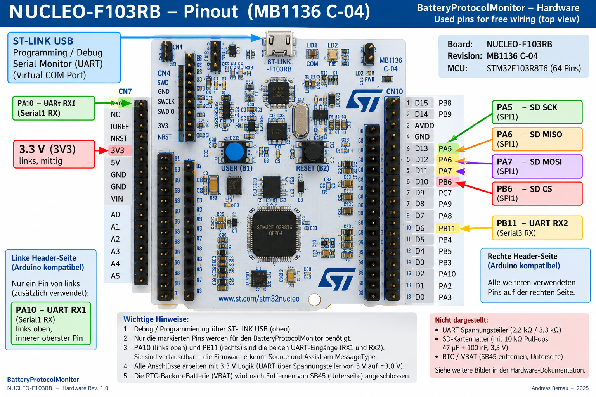
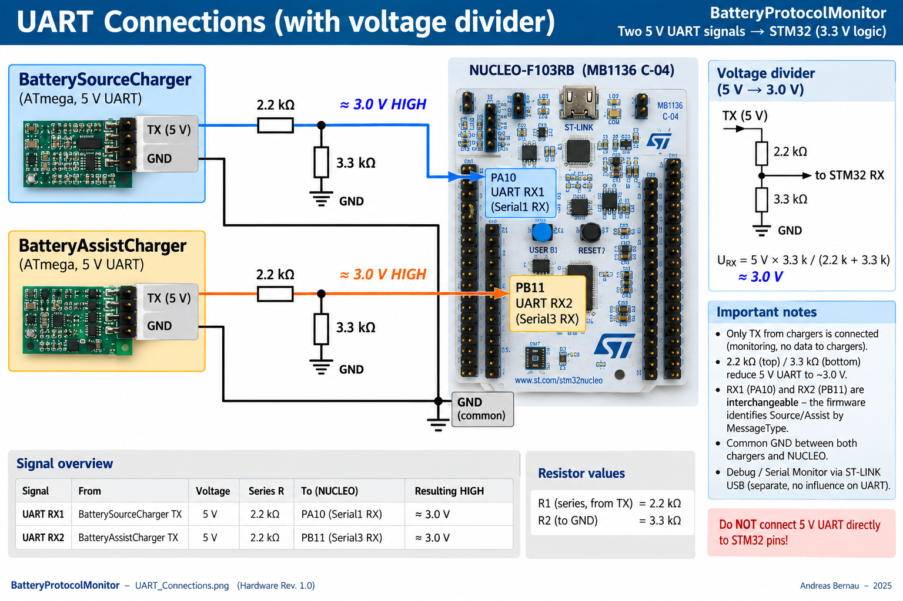
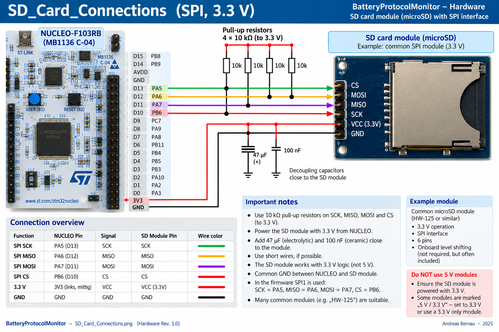
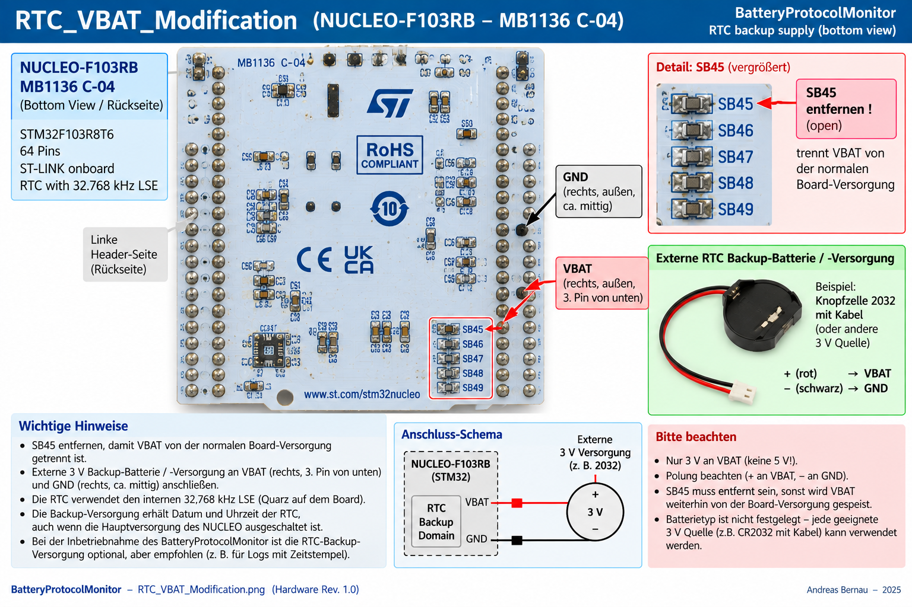

# BatteryProtocolMonitor Hardware

## Overview

The BatteryProtocolMonitor hardware is intentionally simple.

The current implementation uses an:

```text
STMicroelectronics NUCLEO-F103RB
Board revision: MB1136 C-04
MCU: STM32F103RBT6
```

No dedicated PCB is required.

The additional hardware is implemented as **free wiring** around the NUCLEO board.

The monitor passively observes the communication between:

```text
BatterySourceCharger
        │
        │ TX
        ▼
BatteryProtocolMonitor
        ▲
        │ TX
        │
BatteryAssistCharger
```

Only the charger TX signals are connected to the monitor.

The BatteryProtocolMonitor does not transmit data back to either charger and therefore does not participate in charger control.

The current hardware provides:

- two independent UART receive inputs
- 5 V → approximately 3.0 V UART level reduction
- SD card logging
- RTC with battery backup
- ST-LINK USB for programming and commissioning
- preparation for a future local status display


---

## NUCLEO-F103RB Pinout

The following image shows the NUCLEO-F103RB connections used by the BatteryProtocolMonitor.



Only a small number of NUCLEO pins are required.

| Function | STM32 / NUCLEO pin | Purpose |
|---|---|---|
| UART RX1 | PA10 | Charger communication input 1 |
| UART RX2 | PB11 | Charger communication input 2 |
| SD SCK | PA5 | SPI1 clock |
| SD MISO | PA6 | SPI1 data from SD card |
| SD MOSI | PA7 | SPI1 data to SD card |
| SD CS | PB6 | SD card chip select |
| SD supply | 3V3 | SD card supply |
| Ground | GND | Common signal ground |
| RTC backup | VBAT | External RTC backup battery |

Most connections are made on the right-hand header of the NUCLEO board.

The 3.3 V supply and one UART input are taken from the corresponding pins on the left-hand side.


---

## UART Monitor Inputs

BatterySourceCharger and BatteryAssistCharger use 5 V logic.

The STM32 operates with 3.3 V logic.

For this reason, each UART receive input uses a simple resistor voltage divider.



For each UART input:

```text
Charger TX
    │
   2.2 kΩ
    │
    ├──────────────► STM32 RX
    │
   3.3 kΩ
    │
   GND
```

For a 5 V UART HIGH level:

```text
URX = 5 V × 3.3 kΩ / (2.2 kΩ + 3.3 kΩ)

URX ≈ 3.0 V
```

This reduces the 5 V charger UART signal to a suitable logic level for the STM32 input.


### UART Connections

```text
UART RX1    PA10    Serial1 RX
UART RX2    PB11    Serial3 RX
```

The two inputs are logically interchangeable.

The firmware identifies Source and Assist from the protocol `MessageType`, rather than relying exclusively on which physical UART receives the frame.

Therefore:

```text
RX1 / RX2
```

are monitor channels rather than control connections.


### Common Ground

The BatteryProtocolMonitor and both chargers require a common signal reference.

Therefore:

```text
BatterySourceCharger GND
BatteryAssistCharger GND
NUCLEO GND
```

are connected together.

Only the charger TX signals are monitored.

No NUCLEO TX connection to either charger is required.


---

## SD Card

The SD card is used for long-term protocol and diagnostic logging.

No active SD-card breakout module is used.

The hardware uses a passive:

```text
full-size SD → microSD adapter
```

as a convenient card holder.

Connections are soldered directly to the contacts on the rear of the adapter.




### SPI Connections

The firmware uses SPI1:

| Function | NUCLEO pin | SD signal |
|---|---|---|
| SCK | PA5 | SCK |
| MISO | PA6 | MISO |
| MOSI | PA7 | MOSI |
| CS | PB6 | CS |
| Supply | 3V3 | VCC |
| Ground | GND | GND |

The SD card operates directly from:

```text
3.3 V
```

There is no 5 V level conversion in the SD interface.


### Pull-up Resistors

The SD interface uses:

```text
10 kΩ pull-up resistors
```

to 3.3 V on the SPI/card signal lines.

These resistors provide defined signal levels, particularly during startup and before the STM32 has completely configured its GPIO pins.


### SD Supply Buffering

Additional supply capacitors are mounted close to the SD-card connection:

```text
47 µF
100 nF
```

Both are connected between:

```text
3.3 V
  │
 capacitor
  │
 GND
```

The 100 nF capacitor provides local high-frequency decoupling.

The 47 µF capacitor provides additional local energy storage for current transients caused by SD-card activity.

This is particularly useful with the free-wired SD-card connection.


---

## RTC

The BatteryProtocolMonitor uses the internal STM32 RTC.

The firmware uses the onboard:

```text
32.768 kHz LSE
```

as the RTC clock source.

The RTC provides timestamps for the monitor logs.

With a backup battery connected to `VBAT`, the RTC can continue running while the normal NUCLEO supply is switched off.


---

## RTC Backup Battery / VBAT Modification

The NUCLEO-F103RB MB1136 C-04 normally connects the STM32 `VBAT` domain to the normal board supply.

For an independent RTC backup supply, this connection has been separated.

On the monitor board:

```text
SB45 = REMOVED
```



SB45 is located on the **bottom side** of the NUCLEO board.

On the MB1136 C-04 board used for this project it is located in the lower-right area of the board, as shown in the image.


### Backup Battery

The current implementation uses a:

```text
CR2032
with cable
```

The connection is:

```text
CR2032 +
    │
    └────────────► VBAT

CR2032 -
    │
    └────────────► GND
```

On the bottom-side header orientation used in the image:

```text
VBAT    right side, outer row,
        3rd pin from bottom

GND     right side, outer row,
        approximately middle
```

The physical board orientation shown in the image should be used when locating these pins.


### Important

SB45 must be open when the external backup battery is used in this configuration.

This separates the external RTC battery from the normal NUCLEO supply.

The RTC backup supply is only intended for the STM32 backup domain.

It is not a power supply for the complete BatteryProtocolMonitor.


---

## Programming and Commissioning

The onboard ST-LINK interface is used for:

```text
Programming
Debugging
Serial Monitor
```

No additional USB-to-UART adapter is required for normal commissioning.

The ST-LINK USB interface is independent of the two charger-monitor UART inputs.

Conceptually:

```text
BatterySourceCharger ──► RX1 ┐
                              │
BatteryAssistCharger ──► RX2 ├──► ProtocolMonitor
                              │
SD Card ◄─────────────────────┤
                              │
RTC ──────────────────────────┤
                              │
                              └──► ST-LINK USB
                                   Debug / Serial Monitor
```

This makes the ST-LINK USB interface particularly useful during development and commissioning.

The complete Source/Assist communication can be observed without modifying the chargers themselves.


---

## Intended Use During Commissioning

The BatteryProtocolMonitor was initially developed as a diagnostic tool for commissioning the complete charging system.

It allows simultaneous observation of:

```text
BatterySourceCharger
BatteryAssistCharger
Communication between both controllers
```

Typical information includes:

- 24 V battery voltage and current
- 12 V battery voltage and current
- available source power
- solar operating state
- MPPT state
- SolarShare information
- charge state
- battery information
- warnings
- errors
- communication quality
- CRC errors
- frame errors
- sequence problems

The SD card additionally allows events to be investigated after they occurred.

This is especially useful for intermittent conditions that cannot easily be reproduced while a computer is connected.


---

## Passive Monitor Principle

A fundamental hardware design requirement is:

> **The BatteryProtocolMonitor must not be required for operation of either charger.**

The monitor therefore remains electrically and logically outside the control loop.

If the monitor is:

```text
switched off
reset
disconnected
or defective
```

communication and charging between Source and Assist must continue independently.

The monitor observes the system.

It does not control it.


---

# Optional Stand-Alone Display

The ProtocolMonitor can later also be used as a permanently installed status monitor in the motorhome.

This is a secondary application and is not required for the basic BatteryProtocolMonitor hardware.


## Intended Use

The idea is deliberately simple:

```text
Display normally OFF

        │
        │ press DisplayON
        ▼

Display ON

        │
        ▼

Quick system overview
```

The user should be able to press one button, look at the display and answer one basic question:

```text
Is everything OK?
```

Conceptually:

```text
┌──────────────────────────────┐
│                              │
│   24 V Battery       OK      │
│   12 V Battery       OK      │
│   Solar              OK      │
│   Communication      OK      │
│                              │
│   SYSTEM             ALL OK  │
│                              │
└──────────────────────────────┘
```

If everything is normal, no further action is necessary.

If something requires attention, the display can provide additional information such as:

```text
WARNING
ERROR
Battery low
Thermal derating
Communication problem
BMS recovery
Solar / charging condition
```


## Display Philosophy

The display is not intended to become another charger controller.

It is only another presentation layer for information already collected by the ProtocolMonitor.

The preferred architecture is:

```text
Source TX ───────┐
                 │
Assist TX ───────┤
                 ▼
          ProtocolMonitor
                 │
        ┌────────┼────────┐
        │        │        │
        ▼        ▼        ▼
      USB       SD      Display
     Debug     Log     Quick View
```

The same decoded monitor data can therefore be used simultaneously for:

- detailed USB diagnostics
- long-term SD logging
- quick local status display


## Planned Display

A possible display for this extension is:

```text
EA W320-8K3
320 × 240
monochrome
```

The display is intended primarily for text and status information rather than graphical history.


## DisplayON Button

A physical `DisplayON` button is planned.

The ProtocolMonitor can continue monitoring and logging while the display remains switched off.

Pressing the button powers or activates the display for a quick inspection.

The practical objective is:

> **One button — one look — everything OK, or something needs attention.**

The final display interface, power switching and pin assignment will be documented separately after the display hardware has been implemented and tested.


---

## Hardware Files

Current hardware documentation:

```text
Hardware/
├── README.md
├── Nucleo_F103RB_Pinout.png
├── UART_Connections.png
├── SD_Card_Connections.png
└── RTC_VBAT_Modification.png
```

The current implementation intentionally has no dedicated PCB.

The images in this directory document the actual free-wired prototype.


---

## Related Documentation

Firmware:

[BatteryProtocolMonitor Firmware](../Firmware/README.md)

Device overview:

[BatteryProtocolMonitor](../README.md)

System documentation:

- [System Architecture](../../Documentation/SystemArchitecture.md)
- [Charging Strategy](../../Documentation/ChargingStrategy.md)
- [Communication Protocol](../../Documentation/CommunicationProtocol.md)
- [Parameters](../../Documentation/Parameters.md)


---

## Hardware Status

The current BatteryProtocolMonitor hardware provides:

```text
NUCLEO-F103RB
      │
      ├── 2 × UART RX
      │      └── 5 V → ~3.0 V resistor dividers
      │
      ├── SD card
      │      ├── SPI1
      │      ├── 10 kΩ pull-ups
      │      └── 47 µF + 100 nF supply buffering
      │
      ├── RTC
      │      ├── 32.768 kHz LSE
      │      ├── SB45 removed
      │      └── CR2032 → VBAT
      │
      └── ST-LINK USB
             └── programming / debug / commissioning
```

This simple free-wired hardware is sufficient for the primary purpose of the device:

> **Observe, record and diagnose the complete Source–Assist charging system without influencing its operation.**

The optional local display can later extend the same monitor into a permanent quick-status instrument for the motorhome.
